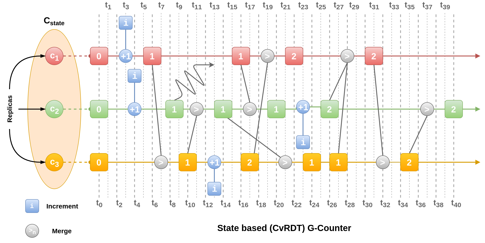

- [link](https://bartoszsypytkowski.com/the-state-of-a-state-based-crdts/)
- Conflict free
	- We could simply use a reader writeres problem here and solve the conflict issue, right?
	- NO! we can't.
	- Because we are not dealing with one client. If the conflicts were happening in one client then such solution will work.
	- But here the conflicts are occurring in multiple clients. We have to sync between these clients.
	- So here conflict free means that we are operating on a data structure, that don't require exclusive write access and are able to detect concurrent updates and perform deterministic, automatic conflict resolution.
	- The core data structures are counters, registers and sets, but from them we can compose more advanced ones like maps, graphs or even JSON.
- Use cases and implementations
	- Amazon uses CRDTs to keep their cart in sync.
	- Dynamo DB which is created by Amazon also uses CRDTs
	- Riak uses CRDTs to implement in-game chat in games like valorant and league of legends.
- MERGE in CRDTs
	- It takes two corresponding replicas of the same logical entity, and produce an updated state as an output.
	- If any conflicts occur, it's up to MERGE operation to resolve them.
	- MERGE operation should conform to three properties:
		- Commutativity and Asociativity
			- Which means that we can perform out of order MERGE operations and still end up with correct state.
		- Idempotency (x + x = x)
			- We don't need to care about potential duplicates send from replication layer.
	- We use two basic operations that meet those criteria:
		- union of two sets
		- maximum of two values.
	- Replication Layer
		- It sends the changes over to all the replicas.
- G-Counter
	- [explanation of working of G-counter](https://www.cs.utexas.edu/~rossbach/cs380p/papers/Counters.html)
	-
	  ```
	  class Counter(CvRDT):
	      def __init__(self, count = 0):  
	          self._count = count
	  
	      def value(self):                
	          return self._count
	  
	      def increment(self):            
	          self._count += 1
	  
	      def compare(self, other):       
	          return self.value() <= other.value()
	  
	      def merge(self, other):         
	          return Counter(max(self.value(), other.value()))
	  
	  
	  ```
	- {:height 401, :width 782}
	- The replicas keep transmitting their state at random times to other randomly chosen replicas.
- An Example
	- If A likes a pic and B don't, then like of pic = 1
	- If A likes the pic at 1s and B likes the pic at 2s, then like of the pic = (max(likes at 1s, likes at 2s))
	- If A likes the pic and B likes the pic at the same time, then the likes of the pic is not 1, rather it's 2.