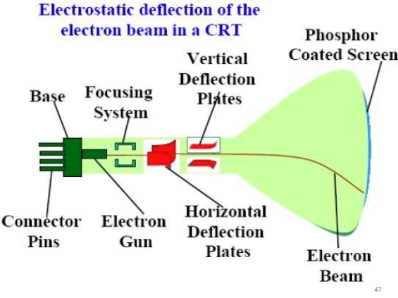
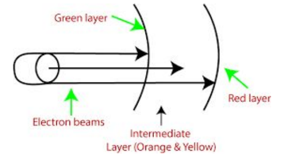
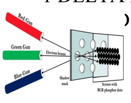
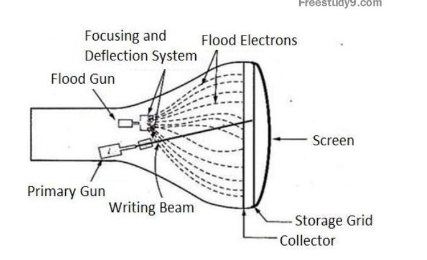

- Syllabus
	- Basic concepts in Computer Graphics
	- Types of Graphic Devices
	- Interactive Graphic inputs
	- Raster Scan and Random Scan Displays
- Legend
	- ? doubt
	- ?? need to study this; pending portions
- 
- # Basic Concepts in Computer Graphics
  collapsed:: true
	- Computer graphics is the pictorial representation or manipulation of data by a computer.
	- ## Non interactive or passive computer graphics
		- The picture is produced by the computer and the user has no control on it.
		- User cannot make any changes in the image
		- Eg: screensavers
	- ## Interactive or active computer graphics
		- User can make changes to the produced image.
		- Users have some control over the picture.
		- Commands can be sent using input devices
		- Eg: games
	- Every image or picture is a graph
		- different mathematical techniques are applied to manipulate some change in its properties like shape, size, motion, etc.
	- Each picture consists of points called pixels (picture element)
	- Pixel
		- Full form of pixel is Picture Element
		- Smallest element of an image on a computer display
		- It is represented as a dot or a square on the screen
		- Pixel can have at most one color at a time
			- Color of a pixel is determined by the number of bytes used to represent it
		- Screen is made up of matrix of pixels
			- thousands and millions of pixels
		- Each pixel has a value or a unique logical address
	- Resolution
		- number of pixels contained on a display monitor
		- measures the number of pixels in a digital image or display
		- It is defined a `width by height` or W x H,
			- W : number of horizontal pixels
			- H : Number of vertical pixels
	- Aspect Ratio
		- Ratio between width of an image and height of an image
		- Two numbers separated by a colon, eg: 16:9
- # Input Devices
  collapsed:: true
	- Input device is any peripheral used to provide
		- data and control signals
		- to an information processing system
	- List of input devices are
		- Mouse
		- Keyboard
		- Trackball
		- Space ball
		- Joystick
		- Digitizer
		- Dials
		- Button boxes
	- ?? Explaining each input devices
- # Applications of CG
  collapsed:: true
	- used in areas such as
		- science, engineering
		- medicine
		- business
		- industry, government
		- art, entertainment
		- advertising
		- education & training
	- ?? Different fields of application
# Video Display Devices
	- ## Cathode Ray Tube
	  collapsed:: true
		- A beam of electro (cathode rays) is emitted using an electron gun
			- they pass through a focussing and deflection system
			- which directs the beam toward specified positions
			- on a phosphor coated screen
		- The phosphor then emits a small spot of light at every position contacted by the electron beam
			- The light fades very rapidly
			- to maintain the spot of light, we repeatedly emit electrons to the same spot
			- This type of display is called Refresh CRT
		- 
		- Beam passes through two pairs of metal plates, one vertical & one horizontal
			- A voltage difference is applied to each plate according to the amount of deflection needed
			- As electron passes in between the plates it moves towards the highly positively charged plate.
			- Deflection can be controlled by adjusting the current in the coil placed around the outside of the CRT loop.
		- The focussing system - make the electron beam to converge into a small spot in the screen as it strikes the phosphor
		- The deflection is controlled either by electric or magnetic fields
		- Persistence
			- How long phosphor will continue to emit light after the CRT beam is removed.
		- Resolution
			- maximum number of non overlapping points that can be displayed on CRT
		- Aspect Ration
			- ratio of vertical points to horizontal points
	- ## Raster Scan Display
	  collapsed:: true
		- It is a common display that employs the CRT
		- It is a television technology
		- Electron beam sweeps across the screen, from top to bottom covering one row at a time.
			- The intensity of the electron beam is turned on and off to create the required pattern
		- The intensity values are stored in a memory area called the refresh buffer or frame buffer
			- It has intensity values for all point on the screen.
			- These intensity values are retrieved and painted on the screen one row at a time.
		- In raster scan systems, the refresh rate is 60 - 80 frames per second
			- Refresh rates are sometimes described in units of cycles per second or Hertz(Hz)
		- After a row is painted, the electron beam moves to the left side to display the next scan line. This is called horizontal retrace of electron beam.
		- At the end of each frame, the electron beam moves to the top left corner to start the next frame.
		- ### Interlacing
			- The process of updating the horizontal lines of a video display on odd and even lines alternatively
				- One frame would update the even lines and the next frame will update the odd lines
			- At a given data rate (the rate at which pixels are updated),
				- the video can be updated faster
				- at the cost of vertical resolution
			- Advantages
				- Realistic image
				- Million different colors to be generated
				- shadow scenes are possible
			- Disadvantages
				- Low resolution
				- Expensive
	- ## Random Scan Display
	  collapsed:: true
		- The electron beam is directed only to the areas of the screen where a picture has to be drawn
			- It is also called vector displays, as it draws picture one line at a time
			- It can drawn and refresh component lines in any specified sequence
		- Raster systems goes row by row while random system goes line by line
		- Pen plotter is an example of random-scan displays
		- The number of lines to be drawn determines the refresh rate on random scan.
			- High quality vector systems can handle around 100,000 short lines at this refresh rate
			- Faster refresh can burn the phosphor
		- An area of memory called the refresh display files stores the picture definitions as a set of commands
	- ## Raster Vs Random
	  collapsed:: true
		- Raster
			- The electron beam scans the screen only 1 line at a time from top to bottom
			- Picture definitions stored in the frame buffer
			- Picture definition stored in the form of intensity values
			- It produces jaggerness
			- Has low resolution
			- Used for realistic images
		- Random
			- The electron beam is directed to the parts of the screen where the picture is to be drawn
			- picture definitions stored in display
			- picture definitions are stored in the form of set of line drawing commands
			- Has high resolution
			- used for line drawing applications
	- ## Color CRT Monitors
	  collapsed:: true
		- CRT monitors display color by using a combination of phosphors that emit different color lights
		- Two methods
			- Beam penetration
			- Shadow mask
		- ## Beam Penetration
			- Used in random scan monitors
			- Two layers of phosphors are coated in the CRT screen
			- Color depends on how far the electron penetrates into the phosphor layer
			- {:height 295, :width 429}
			- The speed of electrons and the screen color at any point is controlled by the beam acceleration voltage
			- Only 4 colors - red, green, orange, yellow
			- Quality of picture not so good
		- ## Shadow Mask Method
			- Commonly used with Raster scan system
			- Produce wider range of color than beam penetration method.
			- Used in majority of TVs and monitors
			- It has 3 phosphor color dots at each pixel.
				- One phosphor dot emit red light, another green and the other blue light.
			- There are 3 electron guns as well, each pointing to one of the three dots in a pixel. And a shadow mask grid just behind the phosphor coated screen.
			- Shadow mask is pierced with small round holes in a triangular pattern
			- 
			- Working
				- Triad arrangement of the red, green and blue guns
				- The deflection system of CRT operates on all 3 electron beams simultaneously.
				- The phosphor dots are arranged in  a way that the beams can only activate the color if it passes through the shadow mask
			- In-line method
				- Instead of the triad arrangement, the color dots can be arranged in an in-line format.
				- The in-line arrangement of electron guns is easier to keep in alignment
					- and is commonly used in high res displays
		- ## Advantages & Disadvantages of Color CRTs
			- Advantages
				- Realistic image
				- million different colors to be generated
				- shadow scenes are possible
			- Disadvantage
				- Relatively expensive
				- Relatively poor resolution
				- convergence problem
	- ## Direct View Storage Tubes
	  collapsed:: true
		- Two guns
			- Primary gun - Used to store the picture pattern
			- Flood gun - used to maintain the picture display
		- 
		- DVST stores the picture definition on a storage grid just behind the phosphor coated screen.
		- Primary gun emits high speed electrons which knock out the electrons in the storage grid to keep the net positive charge
			- The knocked out electrons are attracted towards a collector.
		- Flood gun emits low speed electrons which pass through the storage grid without affecting the net charge and strikes the phosphor coating.
			- During this process, collector smoothens out the flow of flood electrons
		- Advantage
			- Refreshing is not required
			- Very complex picture can be displayed, at very high resolution without flicker
			- Flat screen
		- Disadvantage
			- Do not display color
			- Available at only single level of line intensity
			- Erasing and redrawing takes some time
			- poor contrast
	- ## Flat Panel Display
		- ??