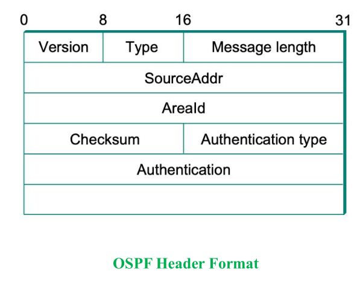

- [[CN Module 4]]
## Syllabus
	- Network layer – Routing – Shortest path routing, Flooding, Distance Vector Routing, Link State Routing, RIP, OSPF, Routing for mobile hosts
## Doubts
	- Should we learn about all the fields in the OSPF header format and Type 1 link state advertisement.
## Network Layer
	- Lowest layer that deals with end to end transmission.
	- It is concerned with getting packets from the source all the way to the destination
	- Getting to the destination may require it to make many hops between intermediate routers along the way.
	- Network layer must know about the topology of the communication subset and choose appropriate paths.
	- It should choose routes to
		- avoid overloading some communication lines and routers
		- while leaving some idle.
	- Problems arise when the source and destination are in different networks.
## Network Layer Design Issues
	- ??
## Routing
	- Main function of network layer is routing packets from source machine to the destination machine.
	- The algorithms that choose the routes and the data structures that they use are a major area of network layer design.
	- Routing Algorithm is that part of the network layer responsible for deciding which output line an incoming packet should be transmitted on.
	- Routing Vs Forwarding
		- Router has two process in it : one is forwarding and the other routing.
		- Forwarding : to select an output port based on destination address and routing table
		- Routing : process by which routing table is built. It is responsible for filling and updating routing tables. That is where routing algorithm comes into play.
	- Forwarding Table
		- Used for forwarding a packet.
		- So must contain enough information to accomplish that function
		- A row in forwarding table contains : mapping from network number to an outgoing interface and some mac information, such as Ethernet address of the next hop.
	- Routing Table
		- Built by the routing algorithm as a precursor to building the forwarding table.
		- Generally contains mappings from network numbers to next hops
## Network as a Graph
	- The basic problem of routing is to find the lowest cost path between any two nodes. Where the cost of a path is the sum of the costs of all the edges that make up the path.
	- For a simple network, we can calculate all the shortest paths and load them into a non volatile storage on each node.
	- Disadvantages:
		- Does not account for node failures
		- Does not account for addition of new nodes.
		- Edges costs cannot change, not flexible.
	- Solution
		- Need a distributed and dynamic protocol
		- Two main classes of such protocols are
			- Distance vector routing
			- Link state routing
## Distance Vector Routing
	- Each node constructs a one dimensional array (a vector)
		- containing the "distances" (costs) to all other nodes and
		- distributes that vector to its immediate neighbours.
	- Assumptions we make are :
		- Each node know the cost of the link to each of its directly connected neighbours.
		- A link that is down is assigned an infinite cost.
	- The distance vector routing algorithms is also called the Bellman-Ford Algorithm.
	- [check the pdf by miss]
	- Every T seconds each router sends its table to its neighbours
		- each router then update its table based on the new information.
	- Disadvantage:
		- ?? Fast response to good news and slow response to bad news
		- Too many messages to update.
	- ?? understand why the following solution is required.
	- One technique to improve the time to stabilize routing is called *split horizon*
		- When a node sends its routing update to its neighbour, it does not send the routes that it learned from that neighbour, back to that neighbour.
		- If B has route (E, 2, A), then it must have learned it from A. So when B sends a routing update to A, it does not send the route (E, 2) in that update.
	- Another version is *split horizon with poison reverse*
		- B actually sends back route to A, but it puts negative information in the route to ensure that A won't use B to get to E.
	- ### Routing Information Protocol (RIP)
		- RIP is a routing protocol built on the distance vector algorithm.
		- Routing protocols in internetworks work differently
			- Instead of advertising the cost of reaching each node, it advertises the cost of reaching each network.
## Link State Routing
	- It is the second major class of intradomain routing protocols.
	- Basic idea : Send to all the nodes (not just the neighbours) information about directly connected links (not the entire routing table).
		- Every node knows how to reach its directly connected neighbour.
		- If every node in the network has such information
		- then every node will have enough knowledge of the network to build a complete map of the network.
	- So Link State Routing depends on two things :
		- reliable dissemination(means spreading) of link state information
		- and calculation of routes from the sum of all the accumulated link state knowledge.
	- LSP has two phases
		- ### > Reliable Flooding
			- Flooding is the process of each node sending its link state information out to its directly connected links;
				- each node that receives this information then forwards it out on all of its links
				- This process continues until the information has reached all the nodes in the network.
			- Each nodes creates an update packet also called the *link state packet (LSP)* with the following information
				- Id of the node that created the LSP
				- List of directly connected neighbours of that node and cost to each
				- Sequence number
				- Time to live for this packet
			- Out of the four
				- first two : need to enable route calculation
				- last two : used to make the flooding of packets to all nodes reliable.
			- Making flooding reliable means to make sure that each node has the most recent copy of lsp information.
			- One important design goals of links state protocol's flooding mechanism is that
				- the newest information mush be flooded to all nodes as quickly as possible,
				- while old information must be removed from the network and not allowed to circulate.
		- ### > Route Calculation
			- Once a given node has a copy of LSP from every other node, it is able to compute a complete map for the topology of the network, and from this map it is able to decide the best route to each destination.
			- How the route is calculted?
				- using Dijkstra's Algorithm
			- [Dijkstra's Algorithm]
			- Each switch, from the LSP's it has collected, computes its routing table using a realization of Dijkstra's algorithm called the forward search algorithm.
			- Each switch maintains two lists : *Tentative* and *Confirmed*.
			- Each of these list contains a set of entries of the form *(Destination, Cost, NextHop)*
			- [Forward Search Algorithm]
	- Advantage of Link State Algorithm
		- it has been proven to stabilize quickly,
		- it does not generate much traffic
		- it responds rapidly to topology changes or node failures
	- Disadvantage
		- amount of information stored at each node is quite large
	- ### Open Shortest Path First Protocol (OSPF)
		- It is a widely used Link-state routing protocol
		- OSPF adds quite a number of features to the basic link state routing
			- Authentication for routing messages
			- Additional hierarchy
			- Load balancing
		- OSPF Header Format
			- 
			- version field → 2
			- Type field → values 1 to 5
			- Source address
			- Areald → 32 bit id of the area in which node is
			  located
			- Entire packet except authentication is protected by
			- 16 bit checksum
			- Auth type –
				- 0,no auth
				- 1, simple pwd
				- 2, cryptographic auth checksum
		- The basic building block of link state messages in OSPF is the link state advertisement (LSA)
		- 1 message may contain many LSA's
		- Type 1 LSA's : Advertise cost of links between routers
		- Type 2 LSA's : Advertise networks to which the advertising router is connected
		- [LSA format]
## Routing for Mobile Hosts
	- Hosts that never move are called sationary
	- **Migratory Hosts**
		- They are basically stationary hosts who move from one fixed site to another from time to time, but use the network only when physically connected to it.
	- **Roaming Hosts**
		- They compute on run and want to maintain connections while on the move
	- **Mobile Hosts**
		- Either of the two latter categories (migratory or roaming)
		- all hosts that are away from home but still want to be connected.
	- Hosts have a permanent address that can be used to determine their home loccations
	- The goal of routing in such systems with mobile hosts is to
		- make it possible to send packets to the home addresses (permanent addresses) and still have the packets efficiently reach them wherever they may be.
	- World is divided up (geographically) into small units called *areas*, where an areas is a LAN or wireless cell
	- Each area has
		- Foreign agent (one or more) which are processes that keep track of all the mobile hosts visiting that area.
		- Home agent, which keeps track of hosts whose home is in the area, but who are currently visiting another area.
	- **Registration Process**
		- Periodically each foreign agent broadcasts a packet announcing its existence and address
		- A newly arrived mobile host waits for such messages. If none arrives quickly enough, the mobile host broadcasts a packet.
		- The mobile host registers with the foreign agent,
			- giving its home address,
			- current data link layer address and
			- some security information
		- Foreign agent contacts the mobile host's home agent
			- it also includes the security information to convince the home agent that the mobile host is really there.
		- Home agent examines the security information which contains timestamp, to prove that it was generated seconds ago, and sends acknowledgment.
		- On receiving acknowledgment from the home agent of the mobile host, the foreign agent make an entry in its table and inform the mobile host that it is now registered.
		- [The home agent does two things]