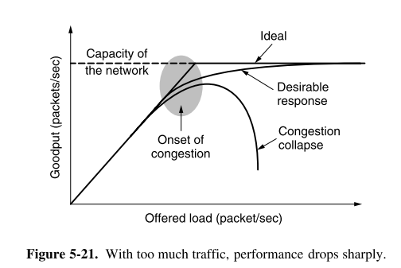

- [[CN Module 3]]
# Syllabus
	- Congestion control algorithms – QoS. Internetworking – Network layer in internet. IPv4 - IP Addressing – Classless and Classfull Addressing. Sub-netting.
# Congestion control algorithms
	- Too many packets being present in the network causing packet delay and loss that degrades performance, this situation is called congestion.
	- Network layer and transport layer are responsible for handling congestion.
	- This module we'll learn about how the network layer deals with congestion.
	- 
	-
	  #+BEGIN_QUOTE
	  When the number of packets hosts send into the network is well within its carrying capacity, the number delivered is proportional to the number sent. If twice as many are sent, twice as many are delivered. However, as the offered load approaches the carrying capacity, bursts of traffic occasionally fill up the buffers inside routers and some packets are lost. These lost packets consume some of the capacity, so the number of delivered packets falls below the ideal curve. The network is now congested
	  #+END_QUOTE
	- ## Congestion control categories
		- Open Loop
			- Protocols to prevent or avoid congestion altogether
			- ensuring that the system never enters a congested state
			- Handled either by source or destination
		- Close Loop
			- Protocols that allow system to enter congested state, detect it and remove it.
			- Feedback loop
				-
				  1. Monito the system to detect whether the network is congested or not, what's the actual location and devices involved.
				-
				  2. Pass this information to places where actions can be taken
				-
				  3. Adjust the system operations to correct the problem
			- Types :
				- Implicit signalling/feedback
					- No communication with the congested nodes
					- When the acknowledgment is delayed, it automatically assumes that there is congestion.
					- on sensing congestion, source slows down.
					- Used by TCP
				- Explicit signalling/feedback
					- Congested nodes explicitly send a signal to the source or destination indicating that there is congestion in the network.
					- this signal is included in the packets that contain data
					- it can happen either in the forward direction of backward direction
					- Forward signalling
						- a bit is set in a packet moving in the direction of the congestion.
						- Bit warns the destination about the congestion
					- Backward signalling
						- a bit is set in a packet moving in the direction opposite to the congestion
						- Bit warns the source about the congestion
	- ## Congestion Prevention Policies
		- ??
# Quality of Service
	- source : Behrouz A.Forouzan Data Communications and Networking.pdf
	  background-color:: #497d46
	- QOS determined by four primary parameters
		- Reliability
		  collapsed:: false
			- Lack of reliability means losing a packet or acknowledgment
		- Delay
		- Jitter
		  collapsed:: false
			- Jitter is the variation in packet delays
			- if packets sent at time units 1, 2, 3, 4 and they are received at 21, 22, 23, 24 then the delay is 20 time units
			- But if the packets arrive at 21, 24, 28, 23, then we say that there is a variation in packet delay.
		- Bandwidth
	- ## Techniques for Achieving Good quality of service
		- ### Overprovisioning
			- it means to provide so much router capacity, buffer space and bandwidth that the packets just fly through easily.
			- Disadvantage
				- it is really expensive
		- ### Buffering
			- Flows can be buffered on the receiving side before being delivered to a output device
			- It does not affect reliability or bandwidth
			- it does increase delay
			- but it smoothens out the jitter.
		- ### Traffic shaping
			- Mechanism to control the amount and the rate of the traffic sent to the network.
			- Monitoring traffic flow : traffic policing
			- Agreeing to a traffic shape and policing it afterward is easier with virtual circuit subnets than with datagram subnets.
			- When a connection is set up, the user and the subnet agree on a certain traffic pattern for that circuit, this is called *service level agreement*.
			- Two techniques can shape traffic
				- *Leaky Bucket*
					- Assume a bucket with a hole at the bottom. However fast the water is poured into the bucket, the rate at which the water flows off the bucket through the hole is constant.
					- This is the concept of the leaky bucket
						- Input rate can vary but the output rate remains constant
					- Leaky bucket algorithm is to regulate the maximum number of packets per time unit.
					- Leaky bucket algorithm consists of a finite queue.
					- When the bucket is full the packets are discarded.
						- when a packet comes and if the queue is full then the packet is discarded.
					- Example
						- Assume the bandwidth of a sender is 3 units per second
						- Sender sends 12 units/sec for 2 secs. Thus a total of 24 units/sec
						- Sender then waits a 5s and then sends 2 unit/sec for 3s, thus a total of 6 unit/sec
						- Now the total data send 30units/sec in 10sec
						- At the receiver, this is smoothen using the leaky bucket and 3 units/sec is sent during this 10secs.
					- Leaky bucket algorithm shapes busty traffic into fixed rate traffic by averaging the data rate.
				- *Token Bucket*
					- Leaky bucket algorithm is very restrictive. It does not credit a idle host.
						- If a host is idle for sometime, its bucket is empty. If it then starts sending busty data, then the bucket allows only an average rate.
						- It does not take into account the time the host was idle.
					- Token bucket however allows idle hosts to accumulate credit for the future in the form of tokens
					- The token bucket algorithm allows the output rate to speed up to a certain maximum when a large burst arrives from the host computer.
					- Packets are less likely to be discarded.
					- Sometimes a token bucket is followed by a leaky bucket.
		- ### Resource Reservation
		- ### Admission Control
		- ### Packet scheduling
			- Packets from different flows arrive at a switch or router for processing.
			- Different flows should be treated in a fair and appropriate manner.
			- Several scheduling techniques are designed to improve the quality of service
				- *FIFO Queuing*
					- incoming packets will wait in a buffer(queue) until the node (router or switch) is ready to process them.
					- If the arrival rate > processing rate of the node, then new packets will be discarded.
				- *Priority Queuing*
					- packets are assigned to a priority class
					- each priority class has its own queue
					- Packets in the highest priority queue are processed first
					- Packets in the lowest priority queue are processed last.
					- System does not stop serving a queue until it is empty.
				- *Weighted Fair Queuing*
					- packets are processed in a round robin fashion to avoid starvation
	- ## Responsibility of Network Layer
		- Packet forwarding/routing of packets
			- Relaying of data from one network segment to another by nodes in a computer network.
		- Connectionless communication(IP)
			- A data transmission method used in packed switched networks in which each data unit is separately addressed and routed based on information carried by it.
		- Fragmentation of data packets
			- Splitting of data packets that are too large to be transmitted on the network.
# Internetworking
	- Internetworking is the scheme of interconnecting multiple networks of dissimilar technologies.
	- OR System of interconnected networks is called an internetwork or an internet.
	- Repeaters : low level devices that just amplify or regenerate weak signals
	- Multiprotocol routers : existing in the network layer for dissimilar networks similar to bridges.
	- Transport gateways : used to make connection between two networks at transport layer.
	- Application Gateways : used to connect two parts of an application in application layer
	- Half Gateway : when 2 WAN's run by different organization, gateway is halved and connected by a wire and a neutral protocol is used.
	- Hub : broadcasts data from one port to all other ports in the network.
	- Switch : intelligent device which sends data to particular port
	- Bridge : store and forward devices that adds or deletes fields from frame header.
		- same function as switch but much more primitive and has lesser ports.
	- Router : connects all computer from a LAN to internet using same IP.
	- Internetworking is implemented in Network layer
	- Three variants of Internetworking
		- Extranet
		  background-color:: #787f97
			- It is a network of internetwork that is limited in scope to a single organization or entity
			- but which also has limited connections to the networks of one or more trusted organizations or entities
			- An extranet may also be categorized as MAN, WAN
			- It cannot consist of a single LAN
			- It must have at least have one connection with an external network.
		- Intranet
		  background-color:: #787f97
			- It is a set of internetwork using Internet Protocol and uses IP based tools like web browser and ftp tools that is under the control of a single administrative entity.
			- The administration closes the intranet to the rest of the world and allows only specific users.
			- It is the internal network of a company.
			- A large intranet will have its own web server.
		- Internet
		  background-color:: #787f97
			- A specific internetworking consisting of a worldwide interconnection of governmental, academic, public and private network.
			- Based upon the ARPANET
	- How Networks Differ
		- Some of the differences are in the physical and data link layer such as different modulation techniques or frame formats.
		- Some differences that occur in the network layer are
			-
			  |  item | Some possibility  |
			  |---|---|
			  |  Service offered |  Connection oriented or connectionless |
			  | Protocols  |   |
			  | Addressing  | Flat(802) vs Hierarchical (IP)  |
			  | Multicasting | |
			  | Packet Size | |
			  |Quality of service | |
	- How Networks can be connected
		- Essential difference between using a router and switch is that
			- with a router, the packet is extracted from the frame and the network address in the packet is used for deciding where to send it.
			- with a switch, the entire frame is transported on the basis of its MAC address.
			- Switches do not have to understand the network layer protocol being used to switch packets but routers do