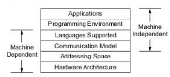

- Flynn's Classifications
	- Classification of computer architectures
	- based on notions of instruction stream and data stream
	- Divided into SISD, SIMD, MISD, MIMD
	- SISD
		- single instruction stream over a single data stream
		- SISD are conventional sequential machines
	- SIMD
		- Vector computers are equipped with scalar and vector hardware and appear as SIMD machines
	- MIMD
		- Parallel computers are reserved for MIMD machines
	- MISD
		- same data flows through an linear array of processors executing different instruction streams.
		- This architecture is called as systolic arrays
		- used for pipelined execution of specific algorithms
- Parallel / Vector Computers
	- Intrinsic parallel computers are those that can execute programs in MIMD mode
	- Two major classes of parallel computers: shared memory multiprocessors & message passing multicomputers
	- Major distinction between multiprocessors and multicomputers lies in the memory sharing and the mechanisms used for interprocessor communication
	- Multiprocessors
		- In such parallel computers, the processors communicate using shared variables in a common memory.
	- Multicomputers
		- Has local memory unshared with other nodes
		- Interprocessor communication done through message passing among the nodes
- Development layers
	- 
## System Attributes to Performance
	- The ideal performance of a computer system depends on the machine capabilities and the program behavior.
	- Clock Rate & CPI
		- CPU is driven by a clock with constant cycle time t (to in greek)
		- Inverse of the cycle time is clock rate, f = 1 / t
		- Size of a program is given by the instruction count. Or the number of instructions to be executed in a program
		- CPI - cycles per instructions. The cycles required to compute an instruction
	- Performance Factors
		- Ic = instruction count, t = clock cycle, CPI = cycles per instruction
		- CPU time (T) = Ic * CPI * t
		- Re written as T = Ic * ( p + m * k ) * Ʈ
		- p = number of processor cycles needed for instruction decode and execution
		- m = number of memory references needed
		- k = ratio between memory cycle and processor cycle
	- System Attributes
		- The above five performance attributes (Ic, p, m, k, Ʈ) are influenced by four system attributes
			- Instruction set architecture
			- compiler technology
			- CPU implementation and control
			- Cache and memory hierarchy
		- Instruction set architecture affects the program length Ic and processor cycle needed p
		- Compiler technology affects the values of Ic, p and m
		- CPU implementation and control determine the total processor time (p * t) needed
		- Memory technology and hierarchy affect the memory access latency (k * t)
	- MIPS Rate
		- equation in pdf
		- processor speed in often measured in million instructions per second (MIPS)
	- Throughput rate
		- equation in pdf
		- number of programs executed in unit time
- Amdahl's Law for Fixed workload
	- As the number of processors increase in a parallel computer, the fixed load is distributed to more processors for parallel execution.
	- Main objective is minimal turnaround time
	- A program (or algorithm) which can be parallelized can be split up into two parts
		- A part which cannot be parallelized and
		- A part which can be parallelized