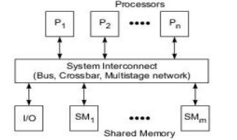
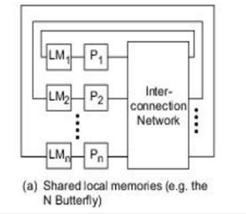
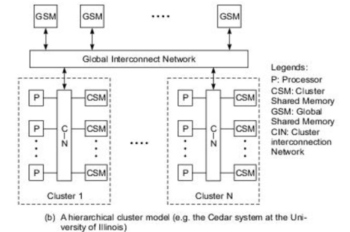
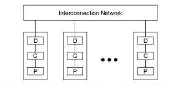
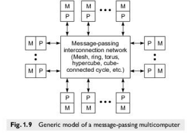
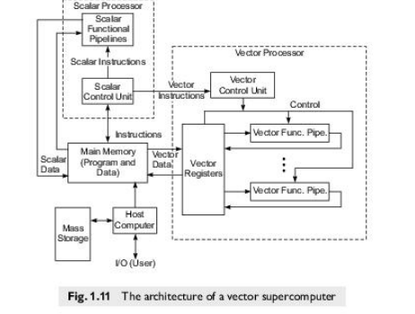
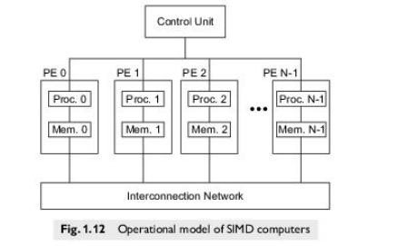
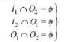

- Flynn's Classifications
  collapsed:: true
	- Classification of computer architectures
	- based on notions of instruction stream and data stream
	- Divided into SISD, SIMD, MISD, MIMD
	- SISD
		- single instruction stream over a single data stream
		- SISD are conventional sequential machines
	- [[SIMD]]
		- Vector computers are equipped with scalar and vector hardware and appear as SIMD machines
	- MIMD
		- Parallel computers are reserved for MIMD machines
	- MISD
		- same data flows through an linear array of processors executing different instruction streams.
		- This architecture is called as systolic arrays
		- used for pipelined execution of specific algorithms
- Parallel / Vector Computers
  collapsed:: true
	- Intrinsic parallel computers are those that can execute programs in MIMD mode
	- Two major classes of parallel computers: shared memory multiprocessors & message passing multicomputers
	- Major distinction between multiprocessors and multicomputers lies in the memory sharing and the mechanisms used for interprocessor communication
	- Multiprocessors
		- In such parallel computers, the processors communicate using shared variables in a common memory.
	- Multicomputers
		- Has local memory unshared with other nodes
		- Interprocessor communication done through message passing among the nodes
- Development layers
  collapsed:: true
	- 
- ## System Attributes to Performance
	- The ideal performance of a computer system depends on the machine capabilities and the program behavior.
	- Clock Rate & CPI
		- CPU is driven by a clock with constant cycle time t (to in greek)
		- Inverse of the cycle time is clock rate, f = 1 / t
		- Size of a program is given by the instruction count. Or the number of instructions to be executed in a program
		- CPI - cycles per instructions. The cycles required to compute an instruction
		  id:: 618e19e1-c984-43f9-a91c-5b2b06016e83
	- Performance Factors
		- Ic = instruction count, t = clock cycle, CPI = cycles per instruction
		- CPU time (T) = Ic * CPI * t
		- Re written as T = Ic * ( p + m * k ) * Ʈ
		- p = number of processor cycles needed for instruction decode and execution
		- m = number of memory references needed
		- k = ratio between memory cycle and processor cycle
	- System Attributes
		- The above five performance attributes (Ic, p, m, k, Ʈ) are influenced by four system attributes
			- Instruction set architecture
			- compiler technology
			- CPU implementation and control
			- Cache and memory hierarchy
		- Instruction set architecture affects the program length Ic and processor cycle needed p
		- Compiler technology affects the values of Ic, p and m
		- CPU implementation and control determine the total processor time (p * t) needed
		- Memory technology and hierarchy affect the memory access latency (k * t)
	- MIPS Rate
		- equation in pdf
		- processor speed in often measured in million instructions per second (MIPS)
	- Throughput rate
		- equation in pdf
		- number of programs executed in unit time
- ## Amdahl's Law for Fixed workload
  collapsed:: true
	- As the number of processors increase in a parallel computer, the fixed load is distributed to more processors for parallel execution.
	- Main objective is minimal turnaround time
	- A program (or algorithm) which can be parallelized can be split up into two parts
		- A part which cannot be parallelized and
		- A part which can be parallelized
	- Consequence of Amdahl's Law
		- For a given problem size, the speedup does not increase linearly as the number of processors increases. The speedup tends to become saturated.
	- Amdhal's law states that the performance improvement gained from using a faster mode of execution is limited by the fraction of the time the faster mode can be used.
	- Need to learn 3 equations from this portion from the slide. Also do the problems.
- ## Multiprocessor models
  collapsed:: true
	- 3 models are
		- Uniform Memory Access model
		- Non Uniform Memory Access model
		- Cache only memory access model
	- These model differ in how the memory and peripheral resources are shared or distributed
	- UMA Model
		- The physical memory is uniformly shared between all processors.
		- 
		- All processors have equal access time to all memory words
		- Processors may have private cache memory
		- Peripheral also shared in similar manner
		- A system interconnect connects the processors to the shared memory units
			- common bus, a crossbar switch or multistage network is used.
		- Tightly coupled systems due to the high degree of resource sharing.
		- UMA model is suitable for general purpose and time-sharing applications by multiple users
		- UMA can speed up the execution of a single large program in time-critical applications
		- Symmetric multiprocessor
		- Asymmetric multiprocessor
	- NUMA model
		- Non Uniform as in the access time to memory is non uniform
		- NUMA multiprocessor is a shared memory system in which access time varies with the location of the memory word
		- Shared memory is physically distributed to all the processors called local memory
		- The collection of the local memories forms a global address space
		- Each processor has access to all the local memories in the system regardless of whether they belong to another processor.
		- 
		- It is faster to access the local memory than to access a remote memory due to the added delay of the interconnection network
		- 
		- Global shared memories can be added to multiprocessor systems
		- It is fastest to access a local memory with a local processor. Then comes the global memory access. Then slowest is the remote memory access.
		- In the above figure, the processors are divided into multiple clusters. Each cluster is itself a UMA or NUMA.
		- Clusters are connected to a global memory
		- All processors belonging to a cluster can uniformly access the cluster shared memory.
		- All processors can access the global share memory.
		- And we can specify the rights for inter cluster memory access.
	- COMA Model
		- Special case of NUMA model
		- Distributed main memory is converted to caches
		- No memory hierarchy is present at each node
		- 
		- Caches form the global memory
		- Data will eventually migrate to where it will be used
		-
- ## Distributed memory multicomputers
  collapsed:: true
	- 
	- The system consists of multiple computers called nodes
		- nodes are interconnected using message passing networks
		- each node is autonomous with its own local memory, processor and even I/O peripherals
	- Message passing networks provide point to point static connections between nodes
	- All local memories are private and can be accessed only by the local processors
		- therefore such machines are called no remote memory access (NORMA) machines
	- Internode communication is carried out by passing messages through a static connection network
	-
- ## Multivector and SIMD computers
  collapsed:: true
	- Supercomputers are classified as
		- Vector supercomputers
		- SIMD supercomputers
	- Vector Supercomputers
		- Vector supercomputer is often built on top of a scalar processor
		- Vector processor is attached to a scalar processor as an optional feature
		- 
		- Program and data are loaded into the main memory, by the host computer
		- All instructions are first decoded by the scalar processor
		- If an instruction is decoded as a scalar operations or program control operation, then it will be executed by the scalar processor
		- Else if it is decoded as a vector operation, then it will be executed by the vector control unit.
	- SIMD Supercomputers
		- 
		- An operational model of SIMD computers are specified using 5-tuple
			- M = (N, C, I, M, R)
		- N = Number of processing elements PE in the machine
		- C = Set of instructions directly executed by the CU
		- I = Set of instructions broadcast by the CU to all the PEs for parallel execution
		- M = Set of masking schemes
		- R = set of data routing functions, for specifying the patterns to be set up in the interconnection network for inter PE communications
## Architectural Development Tracks
	- ??
- ## Conditions of Parallelism
  collapsed:: true
	- In order to move parallel computing into main stream computing, we require improvement in the following areas
		- _Computation models_ for parallel processing
		- _Interprocessor communication_
		- _System integration_ for incorporating parallel systems into general computing environments
	- Types of dependencies are:
		- Data dependency
			- Flow dependence
			- Antidependence
			- Output dependence
			- I/O dependence
			- Unknown dependence
		- Control dependency
		- Resource dependency
	- Data dependency
	  collapsed:: true
		- The ordering relationship between statements is indicated using data dependence.
		- Types of data dependence
			- (Check the denotations in the pdf or notebook)
			- Flow dependence
				- at least one output of S1 feeds in as input to S2
			- Anti dependence
				- output of S2 overlaps the input of S1
				- S1: R1 = R3 + R7 
				  S2: R3 = R4 + R5
				- here R3 is the output of S2 and the input to S1
			- Output dependence
				- Two statements are output dependent if they produce the same output
				- S1:A=B+C
				  S2:A=E-F
			- I/O dependence
				- when the same file is referenced by both I/O statements (read & write)
				- S1: Read (4),A(I)
				  S2: Process
				  S3: Write (4),B(I)
				  S4: Close(4)
			- Unknown dependence
				- ??
	- Control dependence
		- Situation where the order of execution of statements can't be determined before runtime
		- It limits the amount of parallelism
	- Resource dependence
		- Conflict in using shared resources
			- such as integer units, floating point units, registers, memory areas, etc.
	- Bernstein's conditions
		- Set of conditions based on which two processes can execute in parallel
		- Let P1 and P2 be two processes with inputs I1 & I2 and output sets O1 & O2. Then the Bernstein's condition is
			- {:height 136, :width 219}
		- Do the problems in the pdf
- ## Hardware & Software parallelism
  collapsed:: true
	- Hardware parallelism
		- Type of parallelism defined by the machine architecture and hardware multiplicity
	- Software parallelism
		- revealed in the program flow graph or program profile
		- software parallelism is a function of
			- algorithm
			- programming style
			- program design