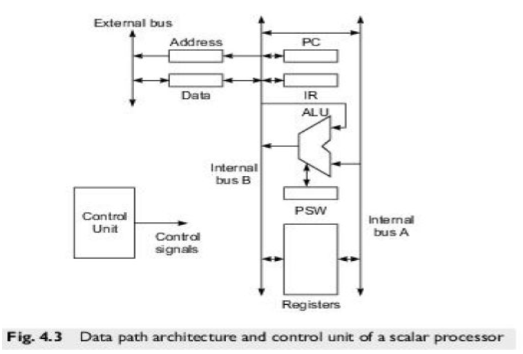
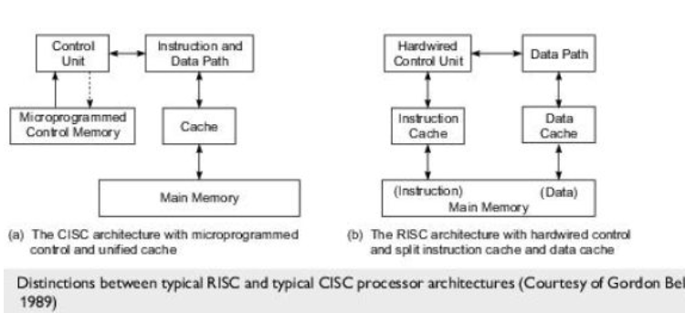
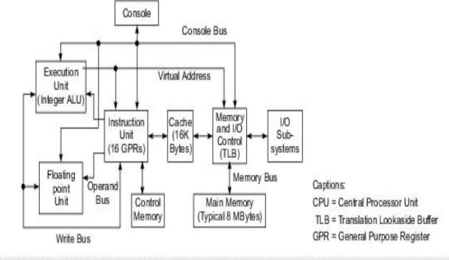

- Syllabus
	- Processors and memory hierarchy – Advanced processor technology- Design Space of processors, Instruction Set Architectures, CISC Scalar Processors, RISC Scalar Processors, Superscalar and vector processors, Memory hierarchy technology.
- 
- CPI = Cycles per Instruction
	- ((618e19e1-c984-43f9-a91c-5b2b06016e83))
- ## Instruction Pipeline
  collapsed:: true
	- Execution cycle of an instruction includes four phases
		- Fetch
		- Decode
		- Execute
		- write-back
	- Instruction pipeline cycle
		- The clock period of the instruction pipeline
		- Time taken for each phase to complete its operation
	- Instruction issue latency
		- the time (in cycles) required between the issuing of two adjacent instructions
	- Instruction issue rate
		- number of instructions issue per cycle
		- also called degree of superscalar processor
	- Simple operation latency
		- simple operations make up the majority of instructions executed
			- integer add, loads, stores, branches, moves, etc
		- complex operations takes more latency such as divides, cache misses
		- latency is measured in number of cycles
	- Resource conflicts
		- two or more instructions demand same functional unit at the same time
	- 
- Instruction set architectures
  collapsed:: true
	- RISC
		- Execution time is very less
		- Decoding instructions is simple
		- Processors are highly pipelined
		- small set of instructions with fixed format
	- CISC
		- Execution time is very high
		- Decoding instructions is complex
		- Less pipelined
		- Large set of instructions with variable formats
	- 
- CISC Processors
	- VAX 8600 Processor
		- 
		- uses CISC architecture with microprogrammed control
		- unified cache
			- used for holding both instructions and data
		- instruction set consists of 300 instructions with 20 different addressing modes
		- two functional units for execution of integer and floating point instructions
			- both integer and floating point units are pipelined
		- Instruction pipelining with six stages
		- Instruction unit
			- prefetched and decoded instructions
			- handled branching instructions
			- supplied operands to the two functional units in pipelined fashion
		- TLB (Translation Lookaside buffer) used in the memory control unit for fast generation of a physical address from a virtual address.