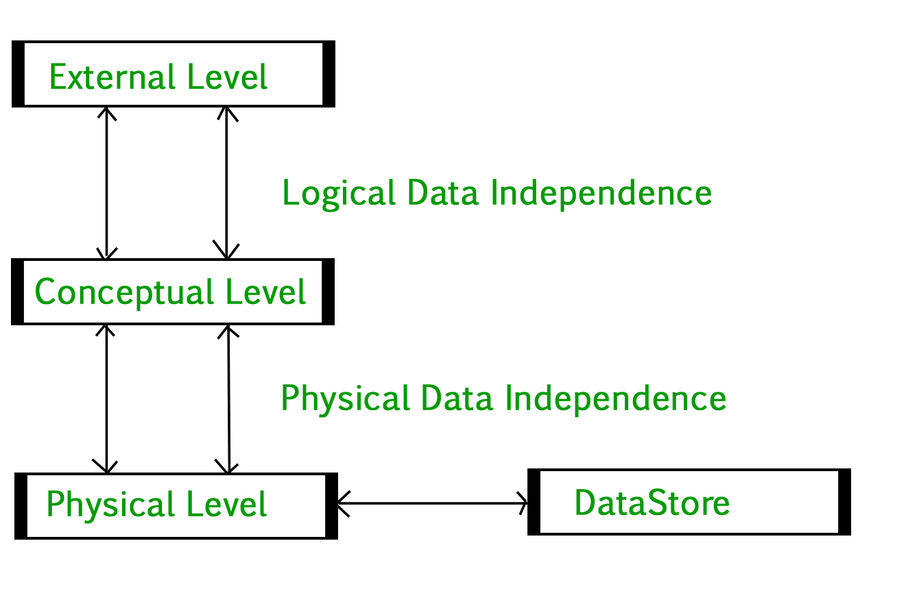

# Introduction
	- 3-tier Archietecture
		- External Level
		- Conceptual Level
			- It deals with how data is stored in a database, i.e using tables.
		- Physical Level
			- It deals which how data is physically stored in storage devices.
			- Normal users don't need to know this information to use databases.
		- 
		- Physical Data independence
			- Any change in the physical location of tables and indexes should not affect the conceptual level or external view of data.
			- Easier to achieve
		- Conceptual Data independence
			- The data at conceptual level and external level should be independent.
			- Harder to achieve because changes in conceptual schema are reflected in the user's view.
	- Need for DBMS
		- DBMS is a system software for easy, efficient and reliable data processing and management.
		- Advantages of DBMS
			- Processing Queries and Object management
			- Controlling redundancy and inconsistency
			- Efficient memory management and indexing
			- Concurrency control and transaction management
				- A DBMD implements *ACID* properties to ensure efficient transaction management without data corruption
					- Atomicity, Durability, Isolation, Consistency
			- Access control and ease in accessing data
			- Integrity constraints
# ER Model
	- It is used to model the logical view of the system from the data perspective
	- It consists of Entity, Entity Type & Entity Set.
	- Entity maybe an object with a physical existence. Say car, person, book, etc.
	- Entity is an instance of an Entity Type.
	- Set of all entities of an Entity Type is called Entity Set.
	- Eg. E1 is an Entity of the Entity type Student.
		- Set of all students is called entity set.
		- {:height 226, :width 114}
	- ## Attributes
		- Properties that define the entity type.
		- Eg: roll_no, Name, Dob, Age, etc are all attributes of Student.
		- In ER diagram they are represented by an Oval.
		- Key Attribute
			- uniquely identifies each entity
			- represented as an oval with underlying line
		- Composite Attribute
			- composed of many other attributes
			- represented in ER as an oval comprising of ovals
		- Multivalued Attribute
			- more than one value
			- represented by a double oval
		- Derived Attribute
			- derived from other attributes
			- represented by dashed line
	- ## Relationship Type and Relationship Set
		- Relationship type represents the association between entity types
		- A set of relationships of same type is known as relationship set.
		- Degree of a relationship set
			- The number of different entity sets participating in a relationship set.
			- Unary relationship
				- only one entity set participating in a relation
				- Eg: one person is married to only one person
				- {:height 130, :width 361}
			- Binary Relationship
				- Two entity sets are participating in a relation
				- Eg : student is enrolled to a course
			- n-ary Relationship
		- Cardinality
			- The number of times an entity of an entity set participates in a relationship.
			- One to One
				- When each entity in each entity set can take part only once in a relationship.
				- Eg: A male can marry to one female and a female can marry to one male.
				- 
			- Many to one
				- When entities in one entity set can take part only once in the relationship set and entities in other entity set can take part more than once in the relationship set.
				- Eg : 1 student can take 1 course. But 1 course can have n students.
				- 
			- Many to Many
				- When entities in all entity sets can take part more than once in the relationship.
				- Eg: 1 student can take n courses, and 1 course can have m students.
			-
		- Participation Constraint
			- Total Participation
				- Each entity in the entity set must participate in the relationship.
				- If each student must enroll in a course, the participation of student will be total.
				- Represented by a double line in ER diagram.
			- Partial Participation
				- The entity in the entity set may or may not participate in the relationship.
				- can represented using sets as
					- {:height 175, :width 369}
	- ## Minimization of ER diagrams
		-
		  | Cardinality  | Min. No. of Table  |
		  |---|:-:|
		  | 1:1 cardinality with partial participation of both entities  | 2  |
		  | 1:1 cardinality with total participation of atleast 1 entity  | 1  |
		  | 1:n cardinality  | 2  |
		  | m:n cardinality  | 3  |
		- [Reference](https://www.geeksforgeeks.org/minimization-of-er-diagrams)
- Normalized vs Denormalized databases
	- Normalized databases offer minimized redundancy and more consistency
	- Denormalized databases offer optimized read time or faster access.
	- Normalized databases requires more expensive joins to access data.