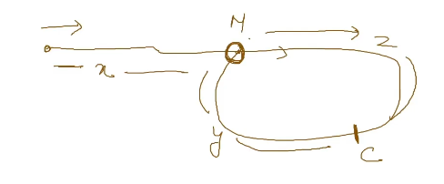

- It is used to detect cycles in a linked list.
- Fast pointer travels twice as fast as slow pointer.
- If slow pointer makes one jump, fast pointer makes two jump
- Assume an array, let's say fast and slow starts from 0. Lets assume each line from now is i th iteration
	- 1st iteration: slow = 1, fast = 2
	- 2nd iteration: slow = 2, fast = 4
	- 3rd iteration: slow = 3, fast = 6.
- Assume a linked list with a cycle.
	- 
	- Let us say that the cycle is complete at M.
	- Also C is the point where fast pointer meets slow pointer.
	- Distance from start to M is `x`.
	- Distance from M to C is `z`
	- Distance from C to M is `y`
	- On meeting, slow travels `x+z` distance and fast travels `x+z+y+z` distance.
	- But we also know `2* slow ` = `fast`
	- i.e `2*(x+z) = x+z+y+z`
	- => `2x+2z = x+y+2z`
	- => `x=y`
	- Thus distance from C to M and start to M are equal once the fast pointer meets the slow pointer.
- Reference
	- [Slow-Fast Pointers](https://youtu.be/G_Lzrae4blg)