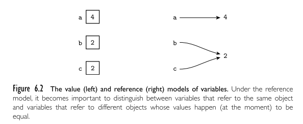

- ## Names, Scopes & Bindings
  collapsed:: true
	- Reference
		- M1 ktustudents pdf
		- Module 1 by Miss
		- Textbook
	- Names
		- mnemonic character string used to represent something
		- Names are usually an identifier. But symbols like := and + can also be names.
		- It allows us to refer to variables, constants, operations, types and so on using symbolic identifiers rather than low level concepts like address
		- Provides abstraction, so that the programmer can associate a name for a complicated program segment.
	- Binding
		- Binding is an association between two things, such as names and the thing it names
		- _Binding Time_ is the time at which a binding is created
			- or generally, the time at which the implementation decision is made to create a name entity binding
		- There are different times at which decisions may be bound
			- language design time
				- control flow constructs, primitive types, constructors for complex types, etc are decided when the language is designed
			- language implementation time
			- program writing time
			- compile time
			- link time
				- some compilers allow separate compilation; to compile different modules of a program at different times
				- linker resolves the intermodule references
				- when a name in one module references an object in another module, then this binding is not done until link time
			- load time
			- run time
		- Early binding (static binding) refers to compile time binding
			- late binding (dynamic binding) refers to runtime binding
		- Early binding times are associated with greater efficiency
			- later binding times are associated with flexibility
	- Scopes
		- Scope of a binding is the part of the program in which the binding is active.
		- It is the range of statements in which the variable is visible.
		- It determines how a name is associated with a variable or expression
		- A variable has local scope if it is declared in a block
		- non local scope if it  is declared outside the block
		- Static scoping
		  id:: 61909ee1-d933-4c45-9cce-42198139a703
			- If scoping follows the structure of the program
			- C is said to be static scoped
		- Dynamic scoping
			- If scoping follows the execution path.
			- Bindings depend on the flow of execution at run time
		- ```C
		  int i = 1; //global variable
		  void printdata()
		  {
		  cout << i << endl;
		  }
		  int main ( )
		  {
		  int i = 2;
		  printdata();
		  return 0;
		  }
		  ```
		- If static scoped, result will be 1
			- scope of a variables definition is resolved by searching its containing block then if that fails, searching the outer containing block and so on
		- If dynamic scoped, result will be 2
			- the calling function is searched first, then the function which called the calling function and so on progressing through the call stack
## Scope Rules
collapsed:: true
	- Static scope
		- ((61909ee1-d933-4c45-9cce-42198139a703))
		- Determination of scopes can be made by the compiler
		- C is statically scoped
		- In basic, all variables are global and visible everywhere
		- In fortran77, the scope of a local variable is in the subroutine & global variable is present everywhere.
## Control Flow
	- Basic paradigms for control flow or ordering in program execution
		- Sequencing
		- Selection
		- Iteration
		- Procedural Abastraction
		- Recursion
		- Concurrency
		- Exception handling
		- Non-determinancy
	- ### Expression Evaluation
		- An expression consists of either
			- a simple object ( a literal constant or variable or constant) or
			- an operator or
			- a function applied to a collection of operands or arguments,
		- A language can choose whether a function call should employ infix, postfix or prefix notations
		- In algol, `a := if b<>0 then a/b else 0`
			- Similar to `a = (b!= 0) ? a/b : 0` in C
		- Most imperative languages use infix notation for binary operations and prefix notation for unary operations
	- ### Precedence & Associativity
		- In any language, precedence and associativity determines the order in which evaluations should take place.
		- In most languages, precedence is arithmetic > relational > logical operators
		- Basic arithmetic operators are left to right associate.
	- ### Assignments
		- Assignments take two arguments : value and a reference to the variable to which the value should be written to.
		- Imperative programming languages - computation by means of side effects
		- Functional languages have no side effects
			- Value of the expression depends only on the referencing environment in which the expression is evaluated, not on the time at which the evaluation occurs.
			- So expressions in functional languages are said to be **referentially transparent**
	- ### References and values
		- consider the C code
		- ```
		  d = a;
		  a = b+c;
		  ```
		- Here in the first statement, the value of a is taken and is placed into d
			- In the second statement, the left hand side refers to the location of a where we want to put b+c.
		- C uses a value model of variables. Above is the value model. Variables are named containers for a value.
			- Left hand side of an assignment statement, one that denotes the location is called _l-value_
			- Right hand side of an assignment statement, one that denotes the value is called _r-value_
		- Languages like Lisp, scheme, haskell uses the **reference model**
			- In reference model, a variable is not a named container for a value; rather it is a named reference to a value.
		- 
		- Java uses value model for built-in types and reference model for user-defined types (classes)
	- ### Boxing
		- A drawback to using value model is that they can't be uniformly passed on to methods that expect class-typed parameters
		- In early version of java, you had to wrap built-in types in a wrapper before passing them onto standard container (collection) classes
			- ```java
			  import java.util.Hashtable; 
			  ...
			  Hashtable ht = new Hashtable(); 
			  ...
			  Integer N = new Integer(13);
			  ht.put(N, new Integer(31)); 
			  Integer M = (Integer) ht.get(N);
			  int m = M.intValue();
			  ```
			- The `Integer` wrapper class is required because java expects an Object and not an Int
		- Recent versions of java perform automatic boxing and unboxing operations that avoid the need of wrapper class.
		- Converting primitive value to an object of corresponding class = autoboxing
		- Converting an object of a wrapper type to its corresponding primitive value = unboxing
-