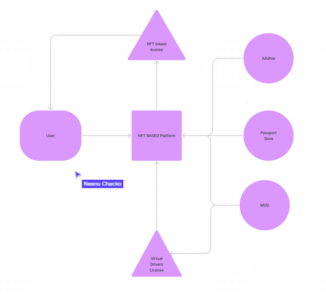

- Problem that we're solving
	- identity verifying for both online and offline
		- verifying the identity of a person both online and offline
	- Stopping identity theft
	- Simplifying identity management and preventing identity theft using NFT's.
- Why should someone use this instead of, say, aadhaar?
- What happens if you're NFT certificate gets stolen?
	- we can detect a breach by using transaction id that was used when the government body minted the NFT to the user.
- Flowchart
	- {:height 358, :width 411}
- Should we use NFT or should we simply store the id number in the blockchain?