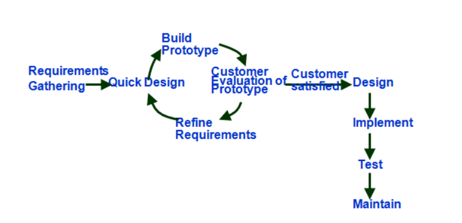
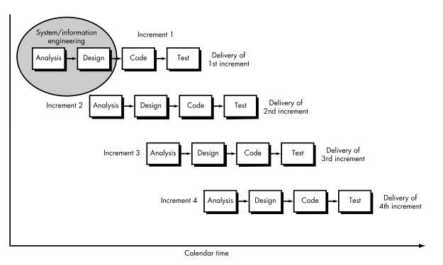
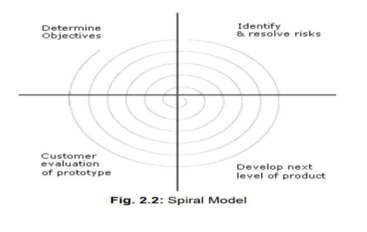

- [[SEPM Module 2]]
- Legend
	- (?) - doubt
- *Introduction to Software Engineering*
	- Software engineering :
	  collapsed:: true
		- Application of systematic, disciplined, quantifiable approach to
		- development, operation and maintenance of software
		- and the study of these approaches
	- Engineering Approach
	  collapsed:: true
		- Requirement analysis and definition
		- System design
		- Program desing
		- writing the program / implementation
		- unit testing
		- integration testing
		- system testing
		- system delivery
		- maintenance
	- Need for Software Engineering
	  collapsed:: true
		- More and more people and society rely on advanced software systems.
		- So producing reliable and trustworthy systems economically and quickly is a must.
		- Issues
			- Heterogeneity
				- Develop techniques for building dependable software that is flexible enough to operate in different types of computers and mobile devices.
			- Business and social change
				- Rapids change in business and society require software to evolve
				- Evolution in such a way that the time required to deliver value to its customers is reduced.
			- Security & trust
				- Malicious users cannot attack our software.
				- Information is secure from abuse.
	- Goals of software Engineering
	  collapsed:: true
		- To increase software productivity and quality
		- To effectively control software schedule and planning
		- To reduce the cost of software development.
		- To meet the customer needs and requirements
		- To improve current practices
		- To support engineering activities in a systematic and efficient manner.
	- Essential Attributes of good software
	  collapsed:: true
		- Maintainability
		- Dependability and Security
		- Efficiency
		- Acceptability
	- (notes of above section from Module 1 Studoob pdf & Module 1 pdf from miss)
- *Scopes of Software Engineering*
  collapsed:: true
	- Historic Aspects
		- Numerous study's show that software is often :
			- delivered late
			- incomplete
			- over budget
			- and with a lot of bugs
		- To compact these the software engineer has to acquire a broad range of skills
		- Both technical and managerial skills are need to be applied to every step of the software production process.
	- Economic Aspects
		- Applying economic principles to SE requires the client to choose techniques that reduce long term costs in economic sense
		- Introducing a new technology in an organization :
			- training cost
			- learning curve
			- initial unproductivity and inability to productive work while learning
	- Maintenance aspects
		- Classical view of maintenance
			- Development then maintenance model
			- This model is unrealistic due to
				- during development, clients requirements may change. This leads to changes to initial specification and design.
				- developers have to perform maintenance before product is installed
				- developers try to use existing software products (?)
		- Modern view of maintenance
			- maintenance occurs when a fault is fixed or when the requirements change irrespective of whether this takes place after or before installation.
		- When I brought the computer, certain softwares came with it in CD. Those softwares are an example of classical maintenance. They won't receive updates.
	- Requirements analysis and design aspects
		- The earlier we correct a fault the better. As time goes on, the cost of correcting a mistake increases.
		- If a mistake is made in the requirements, then it will show up in the specifications then design and then code. Thus we will need to correct the code if we wait till the coding phase to find that fault.
		- It is important to check for new problems when we apply changes.
		- In case of such faults, the correct product must be delivered and reinstalled. Right now updates to our favourite apps are an example of this.
	- Team development aspects
		- Team development leads to
			- difficulties in merging different code components written by different people on the team.
			- It also leads to communication problems among the team members.
- *Software Engineering as a Layered Technology*
  collapsed:: true
	- The layers are :
		- A Quality Focus
			- The bedrock that supports SE is a quality focus.
		- Process
			- The foundation of the SE is the process layer.
			- SE process is the glue that holds the technology layers together and enables rational and timely development of computer software.
			- *SE Process* : Sequence of activities that leads to the production of software product.
			-
			  #+BEGIN_QUOTE
			  Process defines a framework for a set of key process areas (KPAs) [PAU93] that must be established for effective delivery of software engineering technology. The key process areas form the basis for management control of software projects and establish the context in which technical methods are applied, work products (models, documents, data, reports, forms, etc.) are produced, milestones are established, quality is ensured, and change is properly managed.
			  #+END_QUOTE
		- Methods
			- SE Methods provide the technical how-to's for building a software.
			- It includes the array of tasks for creating a software like :
				- analysis
				- design
				- program construction
				- testing
				- support
		- Tools
			- SE Tools provide automated or semi-automated support for the process and the methods.
			- A system where tools are integrated such that the information created by one tool can be used by another tool such that they support the software development is called _Computer Aided Software Engineering (CASE)_.
	- (Taken from Pressman textbook pg.  20)
- *Software Process Models*
	- Also called life cycle models.
	- Types
		- Classical Waterfall model
		  collapsed:: true
			- Obvious way to develop software. Not practical.
			- It is a plan driven process. Everything is planned and scheduled in advance.
			- After one phase complete, we go to the next one. We don't return to the previous one.
			- Classical Waterfall Models divides the lifecycle into phases :
				- Feasibility Study
					- Determine whether project is financially and technically feasible
					- Rough understanding of estimates.
				- Requirements analysis and specificaiton
					- Determines the exact requirements needed by the customer
					- Documents the requirements properly
					- Two activities
						- Requirements gathering and analysis
							- collect relevant information about the product from the customer
						- Requirement specification
							- Done after ambiguity, inconsistencies & incompleteness resolved.
							- user requirements systematically organised into Software Requirements Specification (SRS) document.
				- Desing
					- Goal is to transform the requirements in the SRS document to a structure that can be implemented in a programming language.
					- during this phases the software architecture is derived from the SRS document.
					- Types of approaches are (more info found in Module 1 ktuassist pdf)
						- Traditional
						- Object oriented
				- Coding and unit testing
					- purpose of this phase is to transform the software design to source code.
					- output of this phase : set of program modules that have been individually tested.
				- Integration and System testing
					- Integration of different modules takes place
					- After each integration, the partially integrated system is tested (integration testing).
					- After all the modules are integrated, system testing is done.
					- Goal of system testing : ensures that the developed system conforms with the requirement in the SRS document.
				- maintenance and operation
					- maintenance involves performing any or some of the following activities : (in the Module 1 pdf by miss)
						- Corrective maintenance
						- perfective maintenance
						- adaptive maintenance
			- Pros
				- Easy to understand
				- Works well for small projects
			- Cons
				- No working software until after the system testing phase
				- Making changes to the requirement midway through the process is expensive.
				- Poor for large projects
				- Assumes no defect is introduced during any level of the development activity.
		- Iterative Waterfall Model
		  collapsed:: true
			- Realistically defect will be introduced in each stage.
			- Detecting errors close to where they are introduced. (Phase containment of errors - is the principle of detecting errors .......)
			- when defect is detected :
				- go back to the phase where it originated
				- We tweak the phase where the error originated to remove the error. Required changes are done for the subsequent phases.
			- Ideally errors should be detected in the phases that they are introduced.
		- Prototyping Model
		  collapsed:: true
			- Prototype is a simple (toy) implementation of a system. It often has limited functional capabilities, low reliability and inefficient performance compared to the actual software.
			- Used to help anticipate changes that may be required
			- Can be used when :
				- User requirements not clear : Customer defines general requirements for the software but does not identify detailed inputs, processing or output requirements.
				- Technical issues not clear : Developer unsure of the efficiency of an algorithm, the adaptability of the os , etc.
			- 
			- Quick design is made up of the requirements. It is then evaluated by the customer and changes, if any, are made. This process continues until the customer is satisfied.
			- Need for prototype in SE
				- can gain better understanding of customer needs
				- can get feedback from customer and can change the requirements midst the software development process
				- can gain experience creating prototypes thus able to create a better final product.
				- can be a good way to resolve technical issues.
		- Incremental Model (Evolutionary Models)
		  collapsed:: true
			- Creating a final version of the software by evolving it at each increment using feedback from the customer.
			- System broken down into several modules which are then incrementally implemented and delivered.
			- Each time, a deliverable increment of the software is developed.
			- When this model is used, the first increment, called the core product, addresses the basic requirements. But certain supplementary features remain undelivered.
			- From the feed back of an increment, the plan for the next increment is developed.
			- 
			- Difference from prototype model is that the incremental model focuses on the delivery of a operational product with each increment.
			- Pros
				- Exact customer requirements can be known
				- Reduces maintenance tasks duration as customers approve at each increment.
				- Since error correction done at each increment, final product will have less errors
			- Cons
				- Only helpful for larger projects
		- Spiral Model
		  collapsed:: true
			- Software development process whose diagrammatic representation appears like a spiral with many loops
			- Each loop represents a phase of the software process.
				- Innermost loop is the Feasibility Study
				- Next loop will be the requirements analysis and specification
				- Next one will be design
			- Each loop is split into four sectors (quadrants)
				- 
				- Quadrant 1 : Determine Objectives, alternatives and constraints
					- Identify objectives
					- Examine the risk associated with these objectives
				- Quadrant 2 : Identify and resolve risks
					- Detailed analysis of each identified project risk is carried out
					- steps to reduce the risks are taken
				- Quadrant 3 : Development and Testing
				  collapsed:: false
					- Develop and validate the product
				- Quadrant 4 : Planning
					- Project is reviewed and decision on whether to continue with further loop is decided.
					- If it is decided to continue, plans for next phase of the project is drawn.
			- Spiral model called the meta model since it encompasses all other life cycle models.
			- Pros
				- Risk handling is build into this model.
				- This model is useful for developing technically challenging  software products that are prone to several kinds of risk.
			- Cons
				- This model is a bit too complicated.
				- Costly
				- Risk management require special expertise.
			- What is Risk ?
			  collapsed:: true
				- It is a potential problem that might or might not happen, its an uncertainty.
				- Identifying risks early allows us to develop projects better.
			- Difference between a risk and a problem.
			  collapsed:: true
				- Problem is some event which has already occured.
				- Risk is unpredictable.
			- Types of Risk
				- Project risk
				- Technical risk
				- Known risk
				- predictable risk
				- unpredictable risk
			- What is risk management?
			  collapsed:: true
				- Way of managing the risks involved in such a way that it wont affect the project in a big way.
	- (taken from Module 1 pdf by miss and module 1 studoob pdf and module 1 ktuassist pdf)