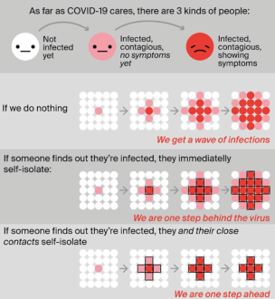
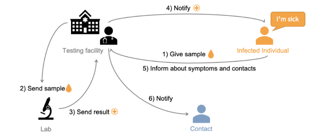

title:: Seminar Paper : DP-3T

- Legend
	- ? : words or concepts I've doubt in.
		- ?this_word means idk what the work means
		- ? this is a sentence and a half. means that its a whole sentence that idk about.
## Decentralized Privacy-Preserving Proximity Tracing
- Due to the lack of a vaccine or any hope for one in such a short notice, the only way to deal with the damage caused by Covid-19 was to reduce the spread of the virus.
- Due to the nature of the Virus, reducing the spread was much difficult. A person could spread the virus even before symptoms appeared. This causes the virus to spread in an exponential fashion.
- Contact tracing is a major part in reducing the spread of covid.
- {:height 501, :width 477}
- Digital proximity tracing systems based on Bluetooth Low Energy (BLE) handshakes between personal smartphones are being widely considered as a tool to help health authorities and government control the spread of the global SARS-CoV-2 outbreak.
- Many countries desire a system which require the infected user be diagnosed by a recognised medical authority before the contact tracing process can begin. This is in contrast to systems that reply on self reporting in which any user can report that they are infected.
## Executive Summary
	- DP-3T is a system for secure and privacy-preserving proximity tracking at large scale.
	- DP-3T provides a technological foundation to help slow the spread of SARS-CoV 2.
	- It achieve this by simply accelerating the process of notifying people who might have been exposed to the virus so that they can take appropriate measures to break its transmission chain.
	- Implementing such a system so that privacy and security are respected is of importance today.
## Context and Need
	- TTIQ - Testing, contact Tracing, Isolation and Quarantine
	- The cornerstone of TTIQ technique is contact tracing.
	- It identifies people who have had contact with the patient and possibly have covid.
	- 2-3 days before the onset of symptoms, that is the period where half of the overall transmission occurs
	- Manual tracing relies on Interviews conducted by trained personnel.
		- Time consuming
		- Require workers
		- Interview response based on memory of the affected person, would not be reliable.
		- Privacy of the patient is violated to obtain information about the contact of the patient.
		- The below figure shows the current contact tracing system.
		- 
## Purpose
	- Purpose of DP-3T is not to identify affected pupil, but to alert the people who have been in contact with the affected person.
	- Alerts you when you've come near contact of a affected person.
	- Doesn't reveal the identity of the contacted person.
## Usability Goals
	- Ease of use for health authorities
	- Ease of use for users
	- The authorisation system should be easy to implement and operate
## DP3T
	- Three different protocols are specified to support different tradeoff's between exposure detection and tracing.
	- Developers can choose the tradeoff they want while using a common framework.
	- Working
		- Each phone locally generates a frequently changing ephemeral identifier (EphIDs)
		- These EphIDs are then broadcasted via Bluetooth Low Energy (BLE) beacons.
			- BLE is a low power wireless communication technology that can be used over a short distance to enable smart devices to communicate.
			- BLE is a relatively new technology with a focus on low energy.
		- Other phones observe these beacons and store them with a time indication and measurements to estimate exposure.
		- When a patient is diagnosed with Covid-19, they will be authorized by health authorities to publish a protocol specific representation of their EphIDs
		- When authorized, users can instruct their phones to upload a representation of the EphIDs to the backend.
		- The backend stores the uploaded representations. To protect the patients from network observers, all phones generate dummy traffic to provide plausible deniability of real uploads.
		- Other phones periodically query the backend for information and reconstruct the corresponding EphIDs of the positive users locally.
		- If the phone has recorded the beacon corresponding to any reported EphIDs, then the phone's user might have been exposed to the virus.
		- The phone uses exposure measurements of the matched beacons to estimate the exposure of the phone's owner.
	- Architecture
		- The proximity tracing process is supported by a backend server.
		- The backend server distributes anonymous exposure information to the app running on each phone.
		- Backend server trusted to not add information nor remove information.
		- Backend solely acts as a communication platform and doesn't process any information.
		- Purpose of this is so that even if the server is compromised or seized, their privacy remain intact.
	- The three protocols are :
		- Low-cost decentralized proximity tracing
		- Unlinkable decentralized proximity tracing
		- Hybrid decentralized proximity tracing
## Low-cost decentralized proximity tracing
	- This is a low cost protocol with good privacy measures along with very small bandwidth requirements.
	- Setup
		- Initial seed generation.
		- Let t be the current day in UTC days.
		- Smartphones generate a random initial daily seed SK t for the current day t.
	- Creating ephemeral IDs
		- Each day, the smartphones rotate their secret day seed SK t by computing SK t = H(SK t - 1)
			- where H is a cryptographic hash function.
		- Smartphone will use the seed SK t during day t to generate EphIDs.
		- To avoid location tracking via broadcast identifiers, devices should frequently change the ephemeral identifier EphID that they broadcast to other devices.
		- The duration for which a device broadcasts the same EphID is referred as epoch.
		- Length of an epoch (in minutes) can be changed using L
		- At the beginning of each day t, smartphones locally generate a list of n = (24*60) / L new EphIDs to broadcast during day t.
		- Give the day seed SK t, each device computes
			- EphID​ 1​ || ... || EphID​ n​ = PRG( PRF(SK t, “broadcast key”) ),
				- where PRF : pseudo random function
				- broadcast key is a fixed public string
				- PRG is the pseudo random generator producing n*16 bytes.
		- Smartphones randomly pick up the EphIDs generated during the day. Each EphID is broadcasted for L minutes.
	- Local storage of observed EphIDs and seeds SK t
		- For each received beacon the phone stores
			- The received ephemeral Bluetooth identifier EphID
			- The exposure measurement
			- The day on which this beacon was received.
		- Being in contact with 100 people per epoch(15 min) over a course of 14day would require 6.1mb
		- Each phone stores the EphIDs it generated during the past 14 days.
	- Decentralized Proximity tracing
		- Once authorized, the patient can instruct their phone to send to the backend the seed SK t and the day t corresponding to the first day in which the user was considered contagious.
		- After uploading their seed, it then picks a completely random seed and commences broadcasting of EphIDs derived from this new seed. This ensures uploading of their past seed, users do not become trackable.
		- The backend collects the pairs (SK t, t) of Covid-19 positive users.
		- Phones periodically download these pairs.
		- Each smartphone users this pair to reconstruct the list of EphIDs of the diagnosed person for each day t' and checks
			- if it has observed any beacon with on of these EphIDs on day t'.
			- that such observations occurred before the corresponding seed SK t was published.
		- For each matching recorded beacon, the beacon's receive time and exposure measurement are taken into account for exposure risk computation.
## Unlinkable decentralized proximity tracing
	- It is a variant of the low cost design
	- It offers better privacy properties at the cost of increased bandwidth.
	- Requires more bandwidth and storage than the low cost design.
## Hybrid decentralized proximity tracing
	- Offers better protection against linking of ephemeral identifiers of covid positive users.
	- But protection against tracking is not that good.